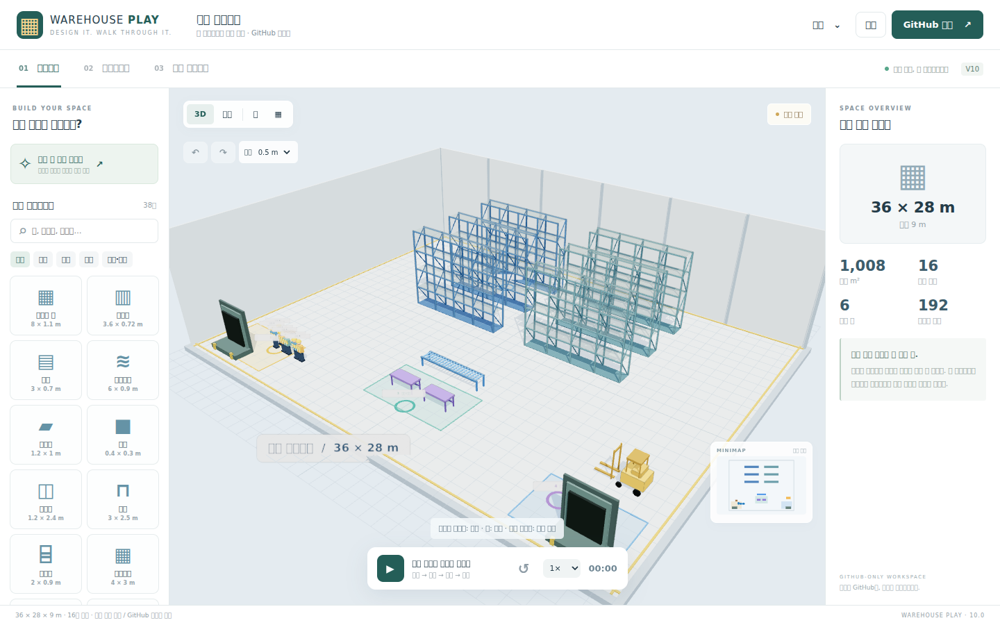

# Warehouse Play 10

**창고를 만들고 → 작업 동선을 움직여 보고 → 작업자 눈높이로 직접 걸어보세요.**

[바로 실행](https://dalmook.github.io/3D_warehouse/) · [작업자 시점 체험](https://dalmook.github.io/3D_warehouse/?project=demo-center.json&mode=walk) · [기존 정밀 편집기](https://dalmook.github.io/3D_warehouse/advanced.html)



## 달라진 점

| 모드 | 할 수 있는 일 |
|---|---|
| **01 배치하기** | 창고 자동 배치 마법사, 38종 설비 라이브러리, 클릭·드래그 배치, 스냅, 크기·위치·색상 변경, 회전·복제·삭제, 실행 취소·다시 실행, 3D·평면 보기 |
| **02 시뮬레이션** | 작업자 1~30명, 입고→보관·피킹→검수·포장→출고 경로, 지점 변경, 장애물을 피하는 A* 경로 탐색, 재생·일시정지·초기화, 0.5~4배속, 완료 사이클·거리·막힌 경로 표시 |
| **03 직접 걸어보기** | 눈높이 1.65m의 1인칭 시점, WASD·방향키, 마우스 고정·드래그 시점, 모바일 방향 버튼·스와이프, 랙·설비·창고 경계 충돌, 미니맵, 시뮬레이션과 동시 실행 |
| **GitHub 저장** | `projects/*.json` 직접 저장·불러오기, 새 파일·수정 커밋, 한글 UTF-8, 변경 충돌 방지, 보기 전용 공유 링크 |

3D 엔진과 설비 모델도 저장소 안에 들어 있습니다. 별도 애플리케이션 서버, 데이터베이스, 유료 클라우드, 런타임 CDN은 사용하지 않습니다. GitHub Pages가 정적 화면을 제공하고 GitHub Contents API가 도면을 저장합니다.

## 처음 사용하는 순서

1. 사이트를 열면 예제 창고가 바로 나옵니다. **창고 한 번에 만들기**에서 크기·랙 행/열·통로 폭을 정하거나, 왼쪽 설비를 고르고 바닥을 클릭합니다.
2. 설비를 드래그하거나 오른쪽 상세 설정을 수정합니다. **시뮬레이션 → 재생**으로 작업 경로를 확인합니다. 작업 지점은 오른쪽 지점을 선택한 뒤 빈 통로를 클릭해서 바꿉니다.
3. **직접 걸어보기**로 현장을 둘러보고, **GitHub 저장**에서 도면을 저장한 뒤 작업자용 링크를 공유합니다.

### 조작

| 상황 | 조작 |
|---|---|
| 설비 놓기 | 라이브러리 선택 → 바닥 클릭. 초록 미리보기는 배치 가능, 빨강은 충돌/경계 초과 |
| 설비 이동 | 설비를 클릭하고 드래그. 숫자로 정확한 위치를 입력해도 됩니다 |
| 회전·취소 | `R` / `Esc` |
| 실행 취소·다시 실행 | `Ctrl+Z` / `Ctrl+Y` 또는 상단 화살표. Mac은 Cmd 지원 |
| 입체 보기 | 마우스 오른쪽 드래그로 회전, 왼쪽 바닥 드래그로 화면 이동, 휠로 확대 |
| 1인칭 이동 | `WASD` / 방향키, `Shift` 빠르게 걷기, `Q/E` 좌우 회전 |
| 1인칭 시점 | **마우스 시점 고정** 또는 화면 드래그. 모바일은 화면 스와이프 |
| 모바일 이동 | 화면 왼쪽 아래 방향 버튼. 미니맵의 주황 화살표가 내 위치 |
| 나가기 | `Esc` 또는 **나가기** 버튼 |

## 서버 없는 GitHub 저장 설정

**로컬 자동 저장과 GitHub 저장은 다릅니다.** 로컬 초안은 현재 브라우저에만 남습니다. 다른 기기에서 열려면 GitHub 저장을 눌러야 합니다. 새로고침만으로 토큰이 자동 복구되지는 않습니다.

### 관리자가 저장할 때

- [GitHub Fine-grained personal access token 생성 화면](https://github.com/settings/personal-access-tokens/new)에서 사용할 저장소만 선택하고 **Repository permissions → Contents → Read and write** 권한을 설정합니다. Metadata 읽기는 GitHub가 기본 허용합니다. 토큰 만료 기간을 적절하게 정하세요. 조직 저장소에는 별도 승인 정책이 적용될 수 있습니다.
- 사이트 우측 상단 **GitHub 저장**에서 소유자 `dalmook`, 저장소 `3D_warehouse`, 브랜치 `main`을 확인합니다. 다른 본인 저장소도 지정할 수 있습니다. 브랜치는 미리 존재해야 합니다.
- 토큰을 **사이트의 마스킹된 입력창**에 입력하고 **연결 / 목록 조회**를 누릅니다. 토큰을 소스 코드, JSON, 채팅, 공유 링크에 넣지 마세요.
- 파일명을 정하고 공개 도면 안내를 확인한 뒤 **GitHub에 저장하기**를 누릅니다. GitHub 성공 응답이 확인되어야 저장 완료로 표시됩니다.
- 기존 파일을 수정할 때는 먼저 **저장된 도면 → 선택 도면 불러오기**로 가져옵니다. 같은 이름의 파일을 임의로 덮어쓰지 않습니다.

토큰은 메모리에만 보관하며 `localStorage`, `sessionStorage`, URL, 도면 파일, 로그에 저장하지 않습니다. 연결 해제 또는 새로고침 시 다시 인증해야 합니다. 토큰은 별도 중계 서버에 전달하지 않고 GitHub API 요청에만 사용합니다.

### 작업자가 열 때

저장 또는 불러오기 후 나오는 **작업자용 보기 링크**를 전달하세요. **공개 저장소**의 도면은 GitHub 계정·토큰 없이 1인칭 탐색과 시뮬레이션을 실행할 수 있습니다. 원본을 편집하지 않는 보기 전용이며, 필요하면 **내 사본 편집하기**로 별도 초안을 만들 수 있습니다.

**이 저장소는 공개입니다. 공개 저장소에 저장한 도면과 이전 커밋은 누구나 볼 수 있습니다. 실제 창고의 민감한 배치, 보안 설비, 개인정보를 저장하지 마세요.** 민감한 자료에는 비공개 저장소를 사용하고 사내 정책을 확인하세요. 비공개 도면은 익명 링크로 열리지 않습니다. 권한이 있는 사용자가 GitHub 창에서 인증하고 도면을 불러와야 합니다.

### 저장 충돌과 오류

다른 탭이나 다른 사람이 같은 파일을 바꿨으면 기존에 불러온 SHA로 저장하는 요청을 GitHub가 거부합니다. 도면을 강제로 덮어쓰지 않습니다. **새 파일명으로 저장**하거나 현재 작업을 JSON으로 백업한 뒤 최신 파일을 다시 불러오세요. 인증 실패, 권한 부족, API 한도, 네트워크 오류도 별도로 알립니다. 자동 저장은 GitHub에 커밋을 반복 생성하지 않습니다.

## 기존 도면과 정밀 편집기

- 이전 `index.html`은 `advanced.html`로 보존했습니다. 기존 `app.js`, `styles.css`, 기준 도면도 유지합니다.
- 기존 `warehouse-studio-project-v1` 로컬 초안이 있으면 새 초안이 없는 경우에만 새 화면으로 읽어 옵니다. **기존 키는 변경하지 않습니다.** 새 화면은 `warehouse-play-project-v10`을 사용합니다.
- schemaVersion 7 기준 도면을 가져올 수 있으며 위치·규격·설비 설정·팔레트 적재 데이터·supportId 관계를 지원합니다. ID가 없는 예전 파일에는 안정적인 ID를 부여합니다. 새 저장은 schemaVersion 10입니다.
- 팔레트별 상세 적재, 랙 칸/단수·용량 편집 등은 **정밀 편집기**에서 사용합니다. 두 편집기는 같은 로컬 초안을 실시간 공유하지 않습니다. JSON 내보내기/가져오기로 전달하세요. 정밀 편집기에서 다시 저장하면 신규 시뮬레이션 설정은 보존되지 않습니다.
- 기존 배포의 `objects.js`와 `vendor/three.core.min.js`가 중간에서 잘려 실행이 멈추는 문제를 복구했습니다. 누락된 설비 빌더와 적재 계산도 복원했고, Three.js는 공식 npm 배포본 `0.185.0`을 저장소에 포함했습니다.

## 정확히 지원하는 범위

이 도구는 **배치·보행 동선을 검토하는 단일 브라우저 시뮬레이션**입니다. 실제 직원 위치 추적, 여러 사용자의 실시간 멀티플레이, 산업용 처리량 예측, 안전 인증은 아닙니다. 완료 사이클과 이동 거리는 시뮬레이션에서 실제 진행한 동작을 집계합니다.

작업자는 설비의 회전된 바닥 점유 영역을 피해 이동합니다. 경로가 없으면 멈추고 경고하며, 완료 처리하지 않습니다. 인원 간 교통·충돌, 지게차 자동 주행, 대기열·공정 능력·안전 이격거리·도크 차량 회전 등은 모델링하지 않습니다. 사무실/클린부스는 외곽 전체를 장애물로 간주하므로 해당 방 내부 보행은 지원하지 않습니다. 상층 통로·계단·엘리베이터는 지원하지 않으며 보행은 바닥층 기준입니다.

현재 입력 상한은 창고 가로/세로 300m, 높이 50m, 설비 1,000개, 작업자 30명, JSON 4MB입니다. 팔레트 적재 시각화는 한 묶음당 최대 1,000개 박스입니다. 상한은 성능을 보증하는 기준이 아닙니다. 저사양 기기에는 작은 도면을 권장합니다. 모바일 터치 UI는 Chromium 에뮬레이션으로 검증하며 실제 Android/iOS 기기별 성능은 별도 확인이 필요합니다.

## 개발·검증

운영 배포에는 빌드나 npm 설치가 필요 없습니다. `main` 루트가 기존 GitHub Pages에서 배포됩니다. 로컬에서 `file://`로 열지 말고 개발용 정적 서버로 엽니다.

```bash
npm ci
npm test
npm run serve
# 별도 터미널: 테스트용 Chromium 설치 후 실제 UI 확인
npx playwright install chromium
npm run test:browser
```

테스트는 `http://127.0.0.1:4178/` 기준입니다. Linux에서 Chromium 공유 라이브러리가 없으면 해당 환경에 맞는 브라우저 의존성을 준비해야 합니다. `PLAYWRIGHT_CHROMIUM_EXECUTABLE`로 기존 Chromium 경로를 지정할 수 있습니다.

검증 기록: [로직 테스트](evidence/unit-tests.tap) · [브라우저 테스트](evidence/browser-tests.json) · [실제 GitHub Contents API 왕복 검사](evidence/github-live-test.json) · [구현 및 한계](docs/IMPLEMENTATION.md). 브라우저 저장 UI는 모의 응답으로, 실제 생성·수정·충돌은 별도 테스트 브랜치에서 GitHub CLI의 Contents API로 검사합니다. 개인 토큰을 브라우저로 옮겨 자동 테스트하지 않습니다.

## 파일 구조

```text
index.html / studio.css / studio.js   새 기본 화면과 조작
studio-core.js                        도면 검증·충돌·A*·작업 시뮬레이션
studio-view.js                        Three.js 장면·작업자·1인칭·미니맵
studio-github.js                      GitHub 직접 저장·읽기·공유
studio-stack.js                       공용 팔레트 적재 계산
studio-catalog.js                     설비 라이브러리
objects.js / vendor/                  절차적 모델과 자체 포함 3D 엔진
projects/demo-center.json             공개 체험용 도면
advanced.html / app.js / styles.css   보존된 정밀 편집기
layouts/                             기존 기준 도면
```

GitHub Contents API: https://docs.github.com/en/rest/repos/contents#create-or-update-file-contents
Three.js: https://threejs.org/docs/
Three.js MIT 라이선스: `licenses/THREE-LICENSE.txt`
